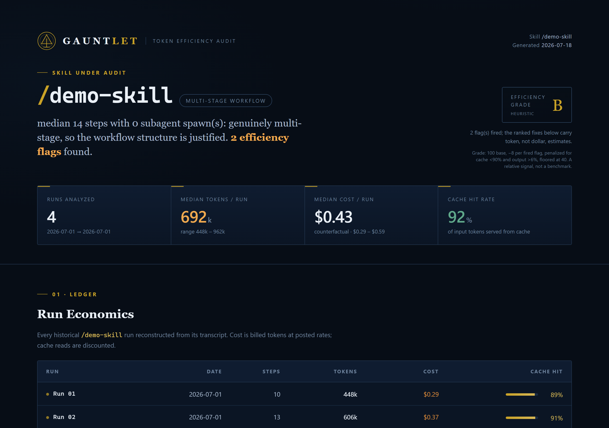

# GAUNTLET

**Find where one Claude Code skill or agent wastes tokens, from the transcripts you already
have.** GAUNTLET turns your existing Claude Code transcripts into a step-by-step efficiency
audit of a single skill or agent. It shows which calls, cache changes, repeated reads, and
context growth consumed tokens, then ranks likely optimization opportunities in a dark,
self-contained local HTML report. It does not re-run the workflow, needs no API key, and
makes no network requests.

[](https://github.com/kdoble/claude-gauntlet/actions/workflows/tests.yml)




See the full sample report: **[live version](https://kdoble.github.io/claude-gauntlet/sample_report.html)**,
or clone and open [`docs/sample_report.html`](docs/sample_report.html) (GitHub shows HTML as
source, so open it locally, or run `python gauntlet.py --demo` yourself). It is produced by
running the real pipeline over synthetic transcripts (`--demo`), not hand-built HTML, so it
shows exactly what you would get.

## Why this matters even on a flat plan

Most Claude Code users pay a flat subscription, so the dollar figures here are counterfactual,
useful for comparing runs, not a bill. The reason to care is the resource that actually runs
out:

- **Rate-limit windows and weekly caps.** A skill that spends more tokens than it needs eats
  further into your 5-hour window and weekly cap, which is fewer runs before you are throttled.
  Real usage depends on model, features, and conversation length, so this is directional, not a
  fixed multiplier, but the direction is what matters.
- **Context rot.** A workflow that reloads the same files or carries bloated context degrades
  its own answers as the window fills. Waste is not just cost, it is quality.
- **Speed.** Fewer, tighter API calls finish sooner.

Dollars are the comparative yardstick. Tokens, cache, and steps are the thing to fix. The
report leads with tokens for that reason; pass `--dollars` to lead with cost.

## Quick start

No history of your own yet? See a full report from synthetic data in one command:

```
python gauntlet.py --demo
```

Then point it at your own usage:

```
python gauntlet.py --all                    # rank every skill/agent by tokens: what to audit first
python gauntlet.py --list                   # every auditable name, with run counts
python gauntlet.py --skill my-skill         # audit one skill
python gauntlet.py --skill researcher       # agents too (traced from their own transcripts)
python gauntlet.py --skill my-skill --shared    # redacted variant; review before sharing
```

**Requirements:** Python 3.9+ and, for a real audit, your own Claude Code usage history under
`~/.claude/projects` (the default location on every OS; override with `--claude-dir`). The
`--demo` path needs nothing but Python.

Run it without cloning. Because this reads your private transcripts, pin a reviewed release
tag rather than running whatever `main` currently holds:

```
uvx --from git+https://github.com/kdoble/claude-gauntlet@v0.1.0 claude-gauntlet --demo
```

(`gauntlet` still works as a command alias, and dropping `@v0.1.0` runs the latest `main`.)

The report defaults to `~/Downloads/gauntlet_report.html` (the directory is created if
missing); override with `--out`. Exit codes: `0` report written, `1` no runs found, `2` bad
transcript root or unreadable baseline. Every flag has `--help` text; `--version` prints the
version.

## How it compares

`ccusage` and Claude Code's built-in `/cost` and `/context` tell you *how much* you spent in
aggregate, across everything. GAUNTLET answers a different question: *why does this one skill
cost what it does?* It reconstructs a single workflow step by step, shows where the cache
breaks and where recon bloats the main context, and names the likely mechanism and the biggest
lever to investigate. Use the aggregate tools to see your total; use GAUNTLET to bring one
workflow down.

Other local transcript tools exist and some go deeper on breadth (per-turn timing, model
think-time, friction and retry analysis, interactive TUIs). GAUNTLET's niche is narrower on
purpose: take one reusable workflow, name the likely waste mechanism, rank an opportunity, and
hand you a shareable artifact plus a before/after baseline to prove a change worked.

## What the report contains

1. **Run economics**: every historical run with steps, tokens, cost, cache hit, plus a
   median-and-range aggregate. No median is claimed below 3 runs (configurable); it shows the
   per-run numbers instead.
2. **The trace**: a step-by-step flow of a representative run. Each node is one billed API
   call: model, tokens in and out, cache-read bar, primary tool. Subagent spawns branch off.
3. **Context growth curve**: cache-read tokens climbing across the run, with the standing
   overhead floor marked.
4. **Efficiency flags**: eight waste checks (repeated reads, cache breakage, heavy recon in
   main context, premium models on mechanical turns, chatty chains, standing overhead, output
   verbosity, workflow shape). Each fires with evidence or reports clean.
5. **Ranked opportunities to investigate**, biggest lever first. These are heuristics, not
   proven wins (a short turn is not proof it was mechanical); validate after you change the
   workflow. The tool never rewrites your skill.

Measured a change? `--baseline prior.json` diffs a saved `--json` output against the current
run and shows what moved. `--since` and `--last` narrow the audit to the runs after a fix.

## Audit it yourself

The whole tool is one stdlib-only Python file. There is nothing to trust on faith:

```
grep -nE "socket|urllib|http\.client|requests|urlopen" gauntlet.py   # no network. nothing.
```

No runtime package dependencies to vet and no telemetry. It reads and parses your transcripts,
writes one HTML file to the path you choose, and that is all. Pin a reviewed release tag when you
install it (see Quick start) so you run code you have looked at. It is MIT licensed; read it, fork
it, keep it.

## Privacy

GAUNTLET reads and parses your transcript files locally. It does not send them anywhere, and it
does not write prompt, response, or tool-result content into the report. Reports contain only
derived metrics and selected labels: counters, model labels, tool names, and file basenames. The
default report is INTERNAL: it shows tool names and file basenames because that detail is the
point. `--shared` aliases project names, file basenames, and non-builtin tool names (a custom MCP
server can be named after a client), then a leak guard scans the output for every real name and
refuses to write the file if any slipped through. The guard is proven by a negative test that
plants a leak and asserts the guard fails.

`--shared` is redacted, not anonymous. It still contains the skill or agent name, exact dates,
models used, run counts, and token and cost figures, so a skill named after a client or an
acquisition can still identify the work. Treat `--shared` as "safe to review, then publish," not
"safe to post blind." Review it before you share it.

## Use it as a Claude Code skill

`SKILL.md` at the repo root makes this installable as a Claude Code skill. Copy the folder into
`~/.claude/skills/gauntlet/` and invoke it in a session with `/gauntlet`. Claude reads the
manifest, runs the auditor, and hands you the report. Using it as a plain CLI needs none of this.

## How a run is defined (attribution, printed in every report footer)

The unit is an **attributed session run**, not a guaranteed one-to-one invocation. Attribution is
a heuristic, and it can distort medians, so it is stated plainly:

- A **skill** run is anchored at the first genuine invocation in a session (a typed slash
  command or a Skill tool call) and spans to the next different skill or end of session. One
  session yields at most one run, so a second invocation of the same skill in that session folds
  into the first, and work done after the skill finished but before another starts is attributed
  to it. Command tags merely quoted inside tool output, JSON blobs, or compaction summaries never
  count: detection is anchored to human-typed command lines.
- An **agent** run is one spawn of that agent (`subagent_type`), traced from the agent's own
  transcript file, so its internal steps are fully counted.

## Honesty rules built in

- Costs are counterfactual metered API pricing (`pricing.json`, editable, dated, with a source
  URL), not your bill. Modeled savings are an upper bound to investigate, not proven wins:
  validate after you change the workflow. The efficiency grade is a heuristic, labeled as such
  with its scoring rubric in the report.
- Below the run floor, per-run numbers are shown and no median is claimed anywhere. The standing
  overhead check uses only runs that started their session, because a mid-session invocation
  inherits the session's prior context; the exclusion is disclosed.
- Calls with an unrecognized model id are priced at a fallback rate and the report says how many.
  Malformed transcript lines are skipped and counted, never fatal.
- For skill runs, subagent-internal turns are not in the parent transcript: a spawn shows as its
  spawn plus the returned digest. Audit the agent itself to see inside.

## Tests

```
python -m unittest discover tests
```

The load-bearing tests prove the guards are not vacuous: the leak checker RAISES on a planted
secret, the waste checks FIRE on fixtures built to trip them and stay silent on clean ones, the
fabrication guards reject command tags quoted inside tool-written JSON, and the pricing staleness
warning is proven to fire on a stale rate card. CI runs the suite on Windows, macOS, and Linux
across Python 3.9 and 3.13 (`.github/workflows/tests.yml`).

## Files

- `gauntlet.py`       the auditor: FIND, TRACE, MEASURE, DIAGNOSE, RENDER
- `pricing.json`      model pricing and cache economics (edit for current rates; dated, sourced)
- `checklist.json`    waste-check thresholds and the averaging floor (every key is live)
- `docs/json_schema.md`  the stable `--json` output schema
- `examples/make_sample.py`  regenerates the synthetic sample report
- `tests/`            unit, negative, and regression suite

## Known limits and roadmap

- Historical mining only; it does not re-run your skill (a live "run it K times" mode is a
  possible future addition).
- Skill-run boundaries are heuristic (next-different-skill or end of session); work done after
  the skill finished in the same session is attributed to it.
- For skill audits, subagent cost shows as spawn-plus-digest, not stitched into the parent
  trace. Audit the agent directly to see inside it. Stitching is on the roadmap.
- **Transcript schema:** parses the Claude Code JSONL shape as of mid-2026 (`message.usage`,
  `message.id`, `<command-name>` tags, `subagent_type`). If a future or older build changes that
  shape you may see zero runs where usage exists. Run `--debug` to see files-scanned versus
  lines-parsed; a high file count with zero runs points to a schema mismatch. Please open an
  issue if you hit one.
- **Prices are illustrative.** `pricing.json` ships editable rates with an `as_of` date and a
  source URL; the report warns when they are stale. Verify against the current provider rate card
  before quoting a dollar figure. The tool's value is the relative efficiency signal, not an
  invoice.

## License

MIT. See [LICENSE](LICENSE).
